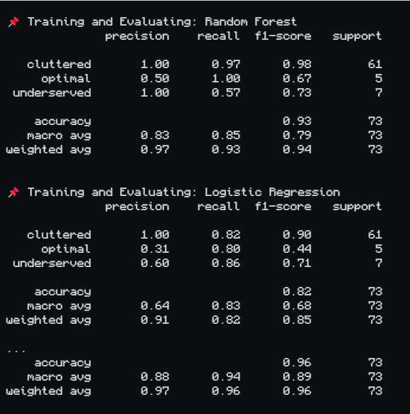
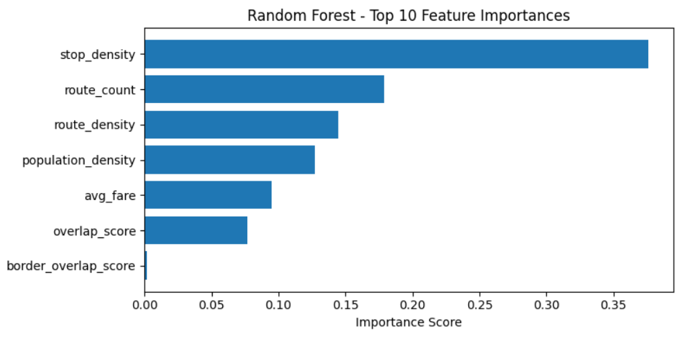
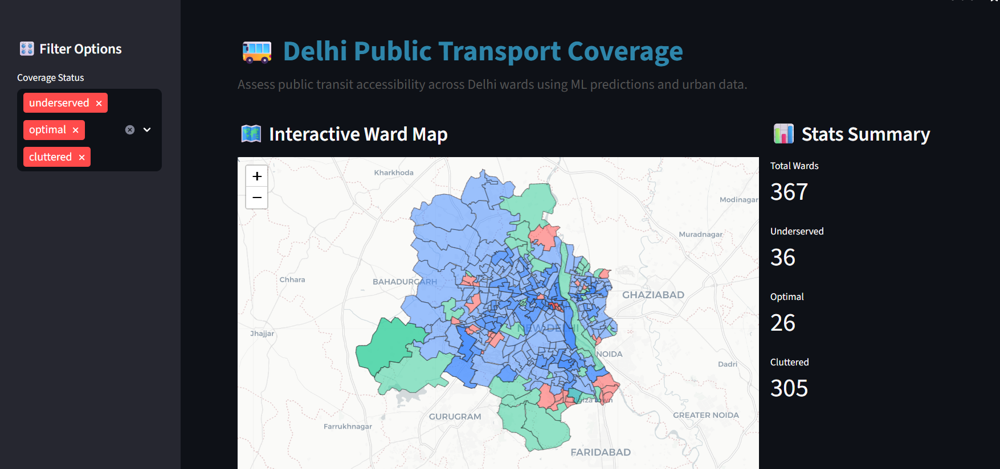

# TransitAnalyzer

TransitAnalyzer is a geospatial machine learning project that analyzes public transport connectivity at the ward level. Trained on Delhi's GTFS transit and population data, it classifies wards as **Underserved**, **Optimal**, or **Cluttered** based on route and stop density, population, and spatial features. The web app uses a pre-trained model to display predictions and insights on an interactive map using Streamlit.

---

## 📊 Model Overview

- Trained using a multi-class classifier (Random Forest, XGBoost) on features derived from GTFS and demographic data.
- Achieved **96% accuracy** and a **macro F1-score of 0.89** on the test set.
- Supports explainability using SHAP and feature importance analysis.



---

## 🔍 Feature Importance

The model ranked the following features as most important for classification:

| Feature               | Importance |
|-----------------------|------------|
| `stop_density`        | **0.3761** |
| `route_count`         | 0.1790     |
| `route_density`       | 0.1447     |
| `population_density`  | 0.1272     |
| `avg_fare`            | 0.0947     |
| `overlap_score`       | 0.0767     |
| `border_overlap_score`| 0.0016     |



---

## 🗺️ Model Predictions on Delhi

The model predicted coverage classifications for each of Delhi’s 367 wards:

- **Cluttered:** 305 wards (~83%)  
- **Underserved:** 36 wards (~10%)  
- **Optimal:** 26 wards (~7%)

These predictions reveal a significant imbalance in stop/route distribution and can inform targeted interventions.



---

## 📁 About the Dataset & Training

- Utilizes GTFS transit data and ward-wise population statistics
- Engineers features like stop density, route overlap, and population density
- Applies a trained multi-class classification model (e.g., Random Forest) to categorize wards as Underserved, Optimal, or Cluttered

---

## 🚀 How to Run

```bash
pip install -r requirements.txt
streamlit run app.py

```
## Project Structure

- `app.py`  
  Streamlit app entry point.

- `models/transit_model.pkl`  
  Trained machine learning model used for ward classification.

- `data/processed/`  
  Contains processed CSV files with ward-level features and predicted coverage categories.

- `geo/delhi_wards.geojson`  
  GeoJSON file containing the spatial boundaries of Delhi wards for mapping.
